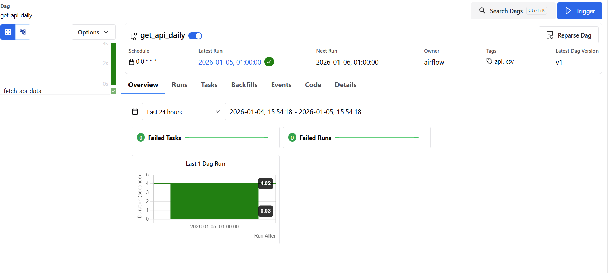

BigData

Projet Big Data – École

Objectif

Ce projet a pour but de :

Consommer une API externe (data.gouv.fr)

Récupérer des données brutes

Générer un fichier CSV

Stocker le fichier dans un dossier data

Les données sont brutes et non modifiées après ingestion.

get_api.py : script Python qui appelle l’API

data/ : dossier de sortie des données

data_raw_100.csv : fichier CSV généré (100 lignes)

Prérequis

Python installé (version 3.x)

Module Python requests

Installation du module si nécessaire :

pip install requests

Lancer le script Python
1️⃣ Ouvrir un terminal

Sous Windows : CMD, PowerShell ou terminal VS Code

2️⃣ Se placer dans le dossier du script
cd airflow-docker/dags

3️⃣ Lancer le script
python dag_hebdo.py

Résultat attendu

Après l’exécution du script :

Un fichier est créé automatiquement :

script/bigdata/data/data_raw_100.csv

Le fichier contient exactement 100 lignes

Les données proviennent de l’API data.gouv.fr

Aucune transformation n’est appliquée (données brutes)

API utilisée

API tabulaire data.gouv.fr :

https://tabular-api.data.gouv.fr/api/resources/1c5075ec-7ce1-49cb-ab89-94f507812daf/data/

