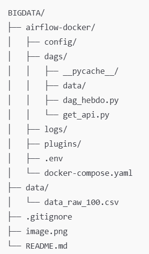
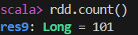
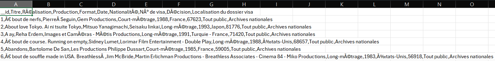

# 📊 Projet Big Data – Ingestion de données via API (Airflow & Docker)

## 🎓 Contexte académique

Ce projet a été réalisé dans le cadre d’un **projet Big Data scolaire** avec Ouissal MASBAHI.  
Il vise à mettre en pratique les notions suivantes :

- Consommation d’une **API externe**
- Ingestion de **données brutes**
- Automatisation via **Apache Airflow**
- Conteneurisation avec **Docker**
- Génération et stockage de données au format **CSV**

---

## 🎯 Objectif du projet

Les objectifs principaux sont :

- Appeler une API publique (**data.gouv.fr**)
- Récupérer des données tabulaires brutes
- Générer un fichier CSV contenant **exactement 100 lignes**
- Stocker ce fichier dans un dossier `data`
- Ne réaliser **aucune transformation** des données après ingestion

---

## 📥 Cloner le dépôt Git

### 1️⃣ Ouvrir un terminal

- Windows : CMD, PowerShell ou terminal VS Code  
- macOS / Linux : Terminal

### 2️⃣ Se placer dans le dossier de travail

```bash
cd chemin/vers/votre/dossier

```

### 3️⃣ Cloner le git

```bash

git clone https://github.com/kyllianlucas/BigData.git

cd BigData

```
🗂️ Structure du projet



📄 Description des fichiers

get_api.py :
Script Python chargé d’appeler l’API data.gouv.fr et de récupérer les données.

dag_hebdo.py :
DAG Apache Airflow permettant d’automatiser l’exécution du script de récupération.

docker-compose.yaml :
Fichier de configuration Docker permettant de déployer Airflow.

data/ :
Dossier de sortie contenant les données brutes.

data_raw_100.csv :
Fichier CSV généré automatiquement contenant 100 lignes de données brutes.

⚙️ Prérequis
Logiciels requis

Git

Python 3.x

Docker

Docker Compose

Modules Python

requests

Installation du module Python :

```bash
pip install requests

```

Exécution sans Docker (Python uniquement)

```bash
cd airflow-docker/dags

python dag_hebdo.py

```

🐳 Exécution avec Docker & Airflow

```bash

cd airflow-docker

docker-compose up -d
```

Accéder à l’interface Airflow

Ouvrir un navigateur :

http://localhost:8080

dentifiants par défaut :

Utilisateur : airflow

Mot de passe : airflow

4️⃣ Activer le DAG

Activer le DAG dag_hebdo

Lancer une exécution manuelle si nécessaire

✅ Résultat attendu

Après exécution :

Un fichier est généré automatiquement :

data/data_raw_100.csv


Le fichier contient exactement 100 lignes

Les données sont issues de l’API data.gouv.fr

Les données sont brutes, non transformées

🌐 API utilisée

API tabulaire officielle de data.gouv.fr :

https://tabular-api.data.gouv.fr/api/resources/1c5075ec-7ce1-49cb-ab89-94f507812daf/data/

🖼️ Illustration


Acces a spark et hadoop

```bash
docker exec -it hadoop-master bash 

docker start hadoop-master 
docker start hadoop-worker1 
docker start hadoop-worker2 
Accéder au conteneur master :  
docker exec -it hadoop-master bash 
Vérifier que Spark est installé : spark-shell --version 
Lancer Spark :spark-shell 

```

en cas de non lancement de spark faire les commandes qui suivent en recommançant la manipulation precedante sauf la derniere commande ou il faut les passez juste avant

```bash
start-dfs.sh
start-yarn.sh
```

Rapport

### 1️⃣ Afficher toutes les données des 5 premières lignes


### 2️⃣ Vérifiacations du nombres de lignes dans le fichier



### 3️⃣ Vérifications des lignes vides


### 4️⃣ Vérifications des doublons


### 5️⃣ On ne peux pas normaliser car a la creation du fichier tous tiens sur une ligne 



🧠 Conclusion

Ce projet permet de démontrer :

La capacité à consommer une API publique

L’ingestion de données brutes en Big Data

L’automatisation avec Apache Airflow

L’utilisation de Docker pour des environnements reproductibles

Il constitue une base solide pour des traitements Big Data plus avancés.
